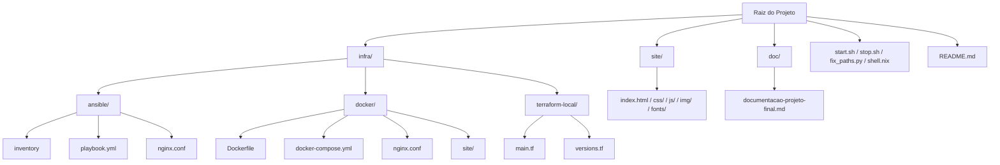

# 🛠️ Projeto Final - Infraestrutura como Código (IaC)

**Disciplina:** Infraestrutura como Código - UFMT 2025  
**Aluno:** Elton  
**Data de Entrega:** 31/03/2025

---

## 📌 Descrição Geral

Este projeto demonstra o uso de Infraestrutura como Código (IaC) para provisionar e gerenciar um ambiente completo de execução para uma aplicação estática, utilizando ferramentas como **Docker**, **Docker Compose**, **Terraform**, **Ansible**, **VS Code** e **Nix**.


O ambiente pode ser levantado de diferentes formas, garantindo flexibilidade para testes, execução e apresentação do projeto.

---

## 🧱 Estrutura de Pastas (Mermaid)



---

## 🚀 Como Executar o Projeto

### 1. Ativar ambiente com Nix

```bash
nix-shell
```

> Isso garante que Docker, Ansible, Terraform e demais dependências estejam carregadas no terminal.

### 2. Escolher método de execução

Rode:
```bash
./start.sh
```
E escolha uma das opções:

- `1`: Subir com Docker Compose
- `2`: Subir com Terraform
- `3`: Subir com Docker direto
- `4`: Subir tudo (Compose + Terraform)

### 3. Acessar a aplicação

Abra no navegador:
```
http://localhost:8080
```

### 4. Finalizar o ambiente

```bash
./stop.sh
```
E escolha uma das opções:

- `1`: Parar Docker Compose
- `2`: Parar Terraform
- `3`: Parar container direto
- `4`: Finalizar tudo

---

## 🧩 Ferramentas Utilizadas

| Ferramenta         | Função |
|--------------------|--------|
| Docker             | Execução de containers |
| Docker Compose     | Orquestração dos containers |
| Terraform          | Provisionamento declarativo |
| Ansible            | Provisionamento imperativo |
| VS Code            | IDE com extensões automáticas |
| Nix / shell.nix    | Ambientes reproduzíveis |
| Git + GitFlow      | Versionamento de código |
| PostgreSQL + Redis | Banco e cache (para simulação local) |

---

## 📷 Prints e Evidências

- ✅ Execução com Ansible
- ✅ Container rodando (Docker)
- ✅ Site no navegador (`localhost:8080`)
- ✅ Diagrama da arquitetura (em `doc/img`)
- ✅ Terminal com ambiente Nix carregado

---

## 📄 Documentação

Arquivo principal: `doc/documentacao-projeto-final.md`

Contém:
- Objetivo
- Tecnologias utilizadas
- Justificativa das escolhas
- Passo a passo de execução
- Diagrama da arquitetura
- Conclusão

---

## 🛠️ Desenvolvedor

**Elton**  
Residência Tecnológica em DevOps  
UFMT - 2025

---

## 📬 Entrega

Este projeto será apresentado no dia **31 de Março de 2025** e enviado por:

- Documento PDF ou Google Docs
- Link do repositório GitHub
- Email com o assunto:

```
Projeto Final IaC UFMT 2025
```

